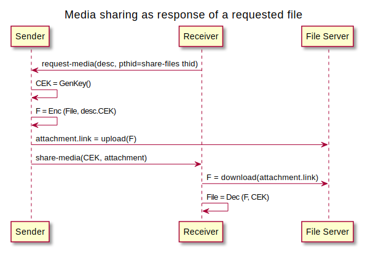
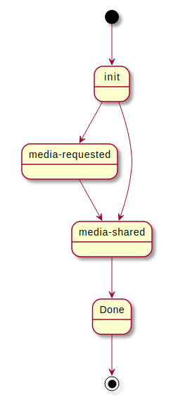
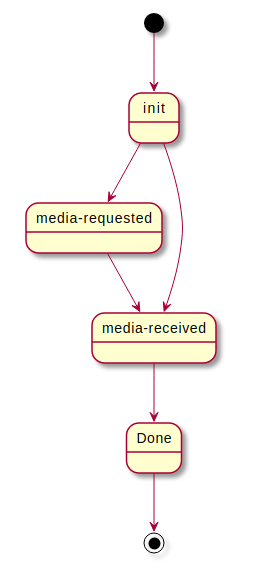

## Summary

A protocol to share large media files (and any content in general) in a secure and efficient manner.

This protocol is intended to be used by any DIDComm agent willing to share large data to a single or multiple connections.

## Motivation

DIDComm allows to establish secure, trusted connections and exchange arbitrary data between parties involved in them. However, due to the fact that it is transport-agnostic and generic enough to be run in a wide range of agents, exchanging _inlined_ data through this channel only might not be as efficient (in terms of bandwith and CPU power) as doing so by using other mechanisms, especially when a large amount of data is being shared and more than a single pair of devices are involved in such exchange (e.g. multi-party connections or peers who are using more than a device).

For such cases, this protocol is defined to share data _by reference_, relying on third-party services to do the actual upload/storage/download. Depending on the trust on such third-party services, files can be previously encrypted or simply left as plain data.

## Roles

There are two roles in this protocol:

- `sender` - The agent willing to share media files
- `receiver` - The agent that will receive the shared media
 
## Basic Walkthrough

In an initial file sharing, the _sender_ will typically generate content encryption keys (CEK) for each file they want to share. This step could be omitted in case of media items that are encoded inline in DIDComm channel.

Then, it will upload encrypted contents in such a way that they are accesible in an URI reachable by the recipient. 

With this information, it will generate the **share-media** message that will be received by the _receiver_, who will download and decrypt all shared files the message might contain. If requested, it will answer with an ack confirming the correct reception of the message (however, this does not mean it could properly interpret or download each shared file). `problem-report` could be used to inform the sender about any issue downloading or decrypting the contents (TODO: define error codes).

<!--
```plantuml
@startuml
title Media sharing basic flow

participant "Sender" as SA
participant "Receiver" as RA
participant "File Server" as FS

SA -> SA: CEK = GenKey()
SA -> SA: F = Enc (File, CEK)
SA -> FS: attachment.link = upload(F)
SA -> RA: share-media(CEK, attachment)
RA -> FS: F = download(attachment.link)
RA -> RA: File = Dec (F, CEK)

@enduml
```
-->


There is another possible flow, where the protocol is started by the request of a previously shared file that appears to not be available by the recipient (e.g. they deleted the file locally and the sender has already deleted it as well from the shared file server). 

In such case, the protocol starts with a **request-media** message which should use the original protocol thid as pthid.

<!--
```plantuml
@startuml
title Media sharing as response of a requested file

participant "Sender" as SA
participant "Receiver" as RA
participant "File Server" as FS

RA -> SA: request-media(desc, pthid=share-files thid)
SA -> SA: CEK = GenKey()
SA -> SA: F = Enc (File, CEK)
SA -> FS: item.links[0] = upload(F)
SA -> RA: share-media(CEK, item)
RA -> FS: F = download(item.links[0])
RA -> RA: File = Dec (F, CEK)

@enduml
```
-->


## States

Depending on the role, the following states are possible:

#### Sender states

- media-requested
- media-shared
- done

<!--
```plantuml
state "init" as Init
state "media-requested" as FileRequested
state "media-shared" as FileShared
[*] -> Init
Init -> FileRequested
FileRequested -> FileShared
Init -> FileShared
FileShared -> Done
Done -> [*]
```
-->


#### Receiver states

- media-requested
- media-shared
- done

<!--
```plantuml
state "init" as Init
state "media-requested" as FileRequested
state "media-received" as FileReceived
[*] -> Init
Init -> FileRequested
FileRequested -> FileReceived
Init -> FileReceived
FileReceived -> Done
Done -> [*]
```
-->


## Message Reference

This protocol currently defines a few specific messages, but uses DIDComm core mechanisms such as attachments and localization (and may use other extensions) to enrich the flow.

### Share Media

Through this message, a sender can share a number of media items, each of them referencing to an [attachment](https://identity.foundation/didcomm-messaging/spec/#attachments) ([appended attachment](https://github.com/hyperledger/aries-rfcs/blob/7759addb1506d107fddec692403bbc9e55fe491f/concepts/0017-attachments/README.md#appending) in case of DIDComm v1), adding a few optional fields regarding the nature of the media being shared.

Appended attachments MUST define at least an `id` and a `media_type` (DIDComm v1) or `mime-type` (DIDComm v2), in order to be properly identified and classified.

The message may indicate the language used for the description. DIDComm V1 and DIDComm V2 have different methods for this. See examples below.
The time the message is sent must be included. DIDComm V2 uses the `created_time` header. DIDComm V1 must include a `sent_time` as a message attribute containing the timestamp in ISO 8601 UTC format.

Description of the fields:

- `description`: (optional) human-readable string to describe (as a whole) the media items to be shared
- `items`: (required) array containing details of the items to be shared. Each containing:
  -  `@id`: (required) unique id for the item. This is used to reference the item from other messages (e.g. request-media)
  -  `attachment_id`: (required) id for the attachment that contains further description of the item itself
  -  `ciphering`: (optional) media ciphering details, containing all required key material for the receiver to decrypt it. Present only in case media has been encrypted.
     -  `algorithm`: symmetric encryption algorithm used to encrypt the media, in the format `<algo>-<length>-<mode>` (lowercase). E.g. `aes-256-cbc`
     -  `parameters`: object containing parameters needed to decrypt the data. This depends on the algorithm used, but the following fields are supported initially:
        -  `key`: content encryption key, formatted as an hex string
        -  `iv`: initialization vector, formatted as an hex string
        -  `tag`: authentication tag, formatted as an hex string
  -  `metadata`: (optional) any relevant information that might the used by an agent to better show the item. Some initial known fields are:
     -  `preview`: base64 string containing a thumbnail (used mostly for images and videos)
     -  `blurhash`: compact representation of a placeholder for an image (used mostly for images and videos)
     -  `duration`: number containing media duration in seconds (used mostly for videos and audio files)
     -  `title`: a descriptible title for the item shared (in addition to the regular `description`)
     -  `icon`: URL or Data URL containing an icon to describe the item

DIDComm v1 example: 

```json
{
    "@id": "8ba049e6-cc46-48fb-bfe0-463084d66324",
    "@type": "<baseuri>/share-media",
    "description": "free text describing the files that are about to be shared",
    "sent_time": "2019-01-15 18:42:01Z",
    "~l10n": { "locale": "en" },
    "items": [
        {
            "@id": "f88b7925-4cb4-4e32-b1d6-ac217c9fedbf",
            "attachment_id": "item1",
            "ciphering": {
                "algorithm": "aes-256-cbc",
                "parameters" : {
                    "iv": "2f3849399c60cb04b923bd33265b81c7",
                    "key": "233f8ce4ac6aa125927ccd98af5750d08c9c61d98a3f5d43cbf096b4caaebe80"
                }
            },
             "metadata": { "blurhash": "LGF5?xYk^6#M@-5c,1J5@[or[Q6." }
        }
        ... 
    ],
    "~attach": [{
        "@id": "item1",
        "byte_count": "23894",
        "mime-type": "image/png",
        "filename": "image1.png",
        "description": "This particular image description",
        "data": {
            "links": [ "https://fileserver.com/ref1-uuid" ]
        },
    }]
}
```

DIDComm v2 example: 

```json
{
    "id": "8ba049e6-cc46-48fb-bfe0-463084d66324",
    "type": "<baseuri>/share-media",
    "created_time": "1547577721",
    "lang": "en",
    "body": {
        "description": "free text describing the files that are about to be shared",
        "items": [
            {
                "@id": "f88b7925-4cb4-4e32-b1d6-ac217c9fedbf",
                "attachment_id": "item1",
                "ciphering": {
                    "algorithm": "aes-256-cbc",
                    "parameters" : {
                        "iv": "2f3849399c60cb04b923bd33265b81c7",
                        "key": "233f8ce4ac6aa125927ccd98af5750d08c9c61d98a3f5d43cbf096b4caaebe80"
                    }
                },
                "metadata": { "blurhash": "LGF5?xYk^6#M@-5c,1J5@[or[Q6." }
            }
            ... 
        ]
    },
    "attachments": [{
                "id": "item1",
                "byte_count": "23894",
                "media_type": "image/png",
                "filename": "image1.png",
                "description": "This particular image description",
                "data": {
                    "links": [ "https://fileserver.com/ref1-uuid" ]
                },
            }
            ... 
    ]
}
```


### Request Media

This message allows a recipient to ask for a previously shared media. This is mainly intended to be used in cases where the shared data is not available anymore in the third-party service used to store it originally.

The message may indicate the language used for the description. DIDComm V1 and DIDComm V2 have different methods for this. See examples below.
The time the message is sent must be included. DIDComm V2 uses the `created_time` header. DIDComm V1 must include a `sent_time` as a message attribute containing the timestamp in ISO 8601 UTC format.


- `description`: (optional) human-readable string describing the request
- `item_ids`: (required) array containing the ids of the requested items

DIDComm v1 example:

```json
{
    "@id": "123456781",
    "@type": "<baseuri>/request-media",
    "sent_time": "2019-01-15 18:42:01Z",
    "~l10n": { "locale": "en" },
    "description": "free text describing the media items that are requested",
    "item_ids": [ "f88b7925-4cb4-4e32-b1d6-ac217c9fedbf", "8ba049e6-cc46-48fb-bfe0-463084d66324" ]
}
```


DIDComm v2 example: 

```json
{
    "id": "123456781",
    "type": "<baseuri>/request-media",
    "created_time": "1547577721",
    "lang": "en",
    "body": {
        "description": "free text describing the media items that are requested",
        "item_ids": [ "f88b7925-4cb4-4e32-b1d6-ac217c9fedbf", "8ba049e6-cc46-48fb-bfe0-463084d66324" ]
    }
}
```

## Implementations

Current implementations of this protocol are listed below:

Name / Link | Implementation Notes
--- | --- 
[Aries JavaScript Media Sharing](https://github.com/2060-io/aries-javascript-media-sharing) | Initial implementation as an extension module for [Aries Framework JavaScript](https://github.com/hyperledger/aries-framework-javascript). Used in [2060.io](https://2060.io) Mobile Agent and Service Agent.

## Endnotes

### Future Considerations
